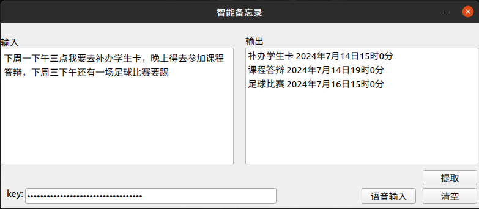

# SmartMemo（智能备忘录）


## 已实现功能
1. 文本输入，文本输出备忘事项和时间
2. 语音输入，文本输出备忘事项和时间
3. 备忘事项前15分钟弹窗提醒
4. 已有备忘事项的存储与读取

## 技术路线
- 使用[qwen-max](https://help.aliyun.com/zh/dashscope/developer-reference/model-introduction?spm=a2c4g.11186623.0.0.6eb046c1HuSBBX)大语言模型对输入文本进行处理
- 使用科大迅飞的[api](https://console.xfyun.cn/services/iat)进行语音转文字
- 使用PyQT5编写UI
- 用**api-key.txt**和**data.txt**存储qwen大模型的api-key和上一次的代办事项，**audio.wav**存储语音输入，三份文件均保存在```~/.SmartMemo/```下（运行程序后自动新建）

## 文件说明
- **test_files**
  - **test_qwen.py**: 终端测试qwen-max的cot效果
  - **test_save_audio.py**: 录音测试
  - **test_save_audio_gui.py**: 带界面的录音测试
- **main_ui.ui**: Qt 5 Designer导出的UI布局文件
- **main.ui.py**: 由**main_ui.ui**转换来的布局文件: ```pyuic5 -o main_ui.py main_ui.ui```
- **main.py**: 其中包含了主界面线程、AI线程、语音线程的代码
- **tools.py**: 包含格式转换、数据读取等函数
- **ai_tools.py**: 调用qwen模型的函数
- **xf_tools.pu**: 调用迅飞api的函数
- **cover.png**: APP图标

## 使用方法（只在ubuntu中测试通过）
1. [安装qwen相关依赖](https://help.aliyun.com/zh/dashscope/developer-reference/quick-start?disableWebsiteRedirect=true)，得到你自己的api-key
2. [安装pyqt5](http://t.csdnimg.cn/i0iK1)
3. [安装迅飞相关依赖](https://www.xfyun.cn/doc/asr/voicedictation/API.html#%E6%8E%A5%E5%8F%A3%E8%AF%B4%E6%98%8E)，得到**语音听写服务中**你自己的APPID、APISecret和APIKey
4. 单独运行**test_files**中各文件以执行对应功能
5. 运行**main.py**，注意我只在UI中做了qwen的api-key的输入框，迅飞相关的个人信息要修改```xf_tools.py```文件的73和74行
